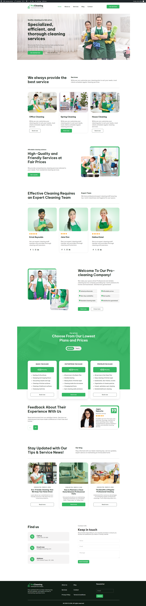

Cleaning Services Landing Page

# Wykorzystane technologie

Projekt został zbudowany w oparciu o:
- WordPress (custom theme)
- PHP
- HTML/SCSS
- JavaScript
- JS Swiper
- Advanced Custom Fields (ACF)
- ACF Blocks
- ACF Options Page
- Custom Post Types
- WP Forms

# Architektura motywu

Motyw został przygotowany zgodnie ze standardową strukturą WordPress:
- podział front page na sekcje
- wykorzystanie front-page.php jako strony głównej
- poprawnie skonfigurowane menu
- logiczny podział komponentów i sekcji

Kod nie zawiera twardo wpisanych treści. Wszystkie dane są wprowadzane z poziomu panelu WordPress

# Zarządzanie treścią

Treści strony są w pełni edytowalne z poziomu zaplecza WordPress:
- sekcje strony oparte na ACF Blocks
- globalne ustawienia (np. dane kontaktowe, miejsce, data eventu) przez ACF Options Page
- services/staff itd jako Custom Post Type
- formularz kontaktowy oparty na WP Forms
- możliwość edycji tekstów, zdjęć i przycisków bez ingerencji w kod